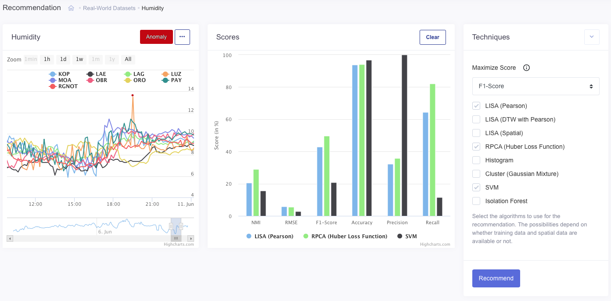

# Vadetis

<a href = "vadetis.exascale.info">VADETIS </a> is a web application to perform, compare and validate various anomaly detection algorithms using different configurations. It allows users to upload their own datasets as well as training data in order to perform anomaly detection. The datasets can be altered by injecting additional outliers.  Technical details can be found in our ICDE 2021 paper:  <a href = "https://icde2021.gr">VADETIS: An Explainable Evaluator for Anomaly Detection Techniques </a>. 

- Vadetis uses the following
    - *anomaly detectors*: One-Class SVM, LISA (Pearson and DTW), GMM, Histogram, Isolation Forest, and Robust PCA.
    - *metrics*: Precision, Recall, Accuracy, F1-score, RMSE, NMI, and AUC.
    - *datasets*: Yahoo serviced dataset (S5), Weather dataset (humidity) and IoT monitoring dataset (Soccer).
- The tool can be easily extended with new algorithms, datasets and  metrics.
- Users can perform a recommendation for the best technique on a specific dataset using different performance metrics.




## Setup and Usage

We provide a runnig Vadetis instance at [vadetis.exascale.info](https://vadetis.exascale.info/).
How to setup the tool either locally in development mode or in a production setting is documented [here](vadetis/README.md)

## Contributors
Mourad Khayati (mkhayati@exascale.info),  Abdelouahab Khelifati (abdel@exascale.info), and Adrian Hänni.

___

## Citation
```bibtex
@inproceedings{vadetis2021icde,
  author = {Khelifati, Abdelouahab and Khayati, Mourad and Cudr{\'{e}}{-}Mauroux, Philippe and Hänni, Adrian and Liu, Qian and Hauswirth, Manfred},
  title = {VADETIS: An Explainable Evaluator for Anomaly Detection Techniques},
  booktitle = {Proceedings of the IEEE International Conference on Data Engineering (ICDE 2021)},
  year = {2021},
  address = {Crete, Greece}
}
```
